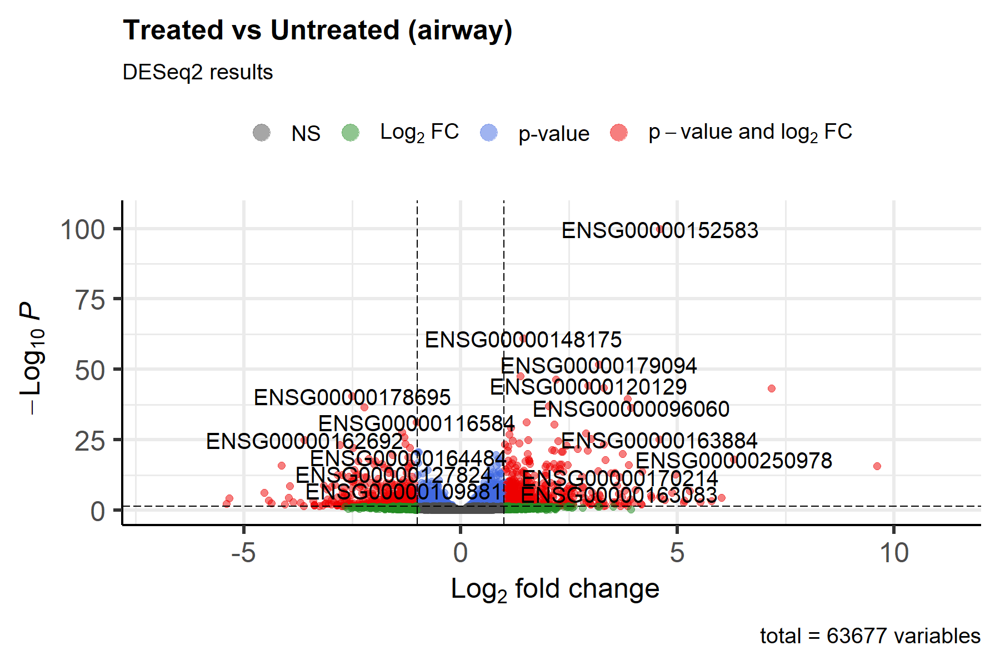

# DESeq2 demo – airway dataset

Eight human airway cell samples (4 treated, 4 untreated).  
Pipeline: load built-in data → DESeq2 → volcano plot → KEGG enrichment.

**Outputs**

| File | Description |
|------|-------------|
| `DESeq2_results.csv` | full differential-expression table |
| `volcano.png` | colourful volcano plot |
| `enrichment_upregulated.csv` | KEGG/GO pathways |

